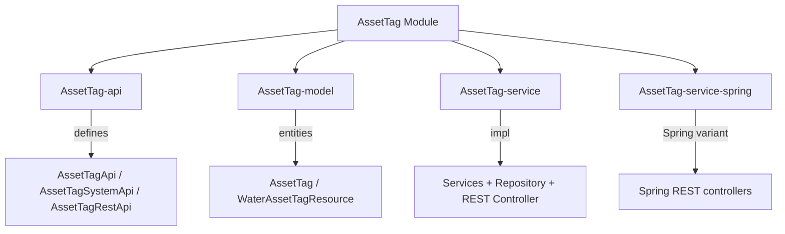

# AssetTag Module

The **AssetTag** module provides a flexible tagging system for Water Framework resources. Users can create named, colored tags and associate them with any resource type. Tags are user-owned (`OwnedResource`) with names unique per owner.

## Architecture Overview



## Sub-modules

| Sub-module | Description |
|---|---|
| **AssetTag-api** | Defines `AssetTagApi`, `AssetTagSystemApi`, `AssetTagRestApi`, and `AssetTagRepository` interfaces |
| **AssetTag-model** | Contains `AssetTag` and `WaterAssetTagResource` JPA entities |
| **AssetTag-service** | Service implementations, repository, and REST controller |
| **AssetTag-service-spring** | Spring MVC variant |

## AssetTag Entity

```java
@Entity
@Table(uniqueConstraints = @UniqueConstraint(columnNames = {"name", "ownerUserId"}))
@AccessControl(availableActions = {CrudActions.class}, rolesPermissions = {...})
public class AssetTag extends AbstractJpaExpandableEntity
    implements ProtectedEntity, OwnedResource { }
```

### Entity Fields

| Field | Type | Constraints | JSON View | Description |
|---|---|---|---|---|
| `name` | String | `@NotNull`, `@NotEmpty`, `@NoMalitiusCode`, unique per owner | Public | Tag label |
| `description` | String | Optional, max 255 | Public | Human-readable description |
| `color` | String | `@Size(min=3, max=7)` | Public | Hex color code (e.g. `#FF5733`) |
| `ownerUserId` | Long | `@NonNull`, `@JsonIgnore` | Hidden | Owner user ID |
| `resources` | Set\<WaterAssetTagResource\> | `@OneToMany`, EAGER | Public | Associated resources |

## WaterAssetTagResource

Maps arbitrary resources to a tag (join table):

| Field | Type | Description |
|---|---|---|
| `resourceName` | String | Fully-qualified class name of the resource |
| `resourceId` | long | Primary key of the resource instance |
| `tag` | AssetTag | The tag this resource is associated with |

## API Interfaces

### AssetTagApi (Public — with permission checks)

Extends `BaseEntityApi<AssetTag>`:

| Method | Description |
|---|---|
| `save(AssetTag)` | Create a tag |
| `update(AssetTag)` | Update name, description, or color |
| `find(long id)` | Find by ID |
| `findAll(delta, page, filter, order)` | Paginated list |
| `remove(long id)` | Delete tag |

### AssetTagSystemApi (System — no permission checks)

Same methods, callable from internal services without a logged-in user.

### REST Endpoints

| HTTP Method | Path | Auth | Description |
|---|---|---|---|
| `POST` | `/assettags` | `@LoggedIn` | Create tag |
| `PUT` | `/assettags` | `@LoggedIn` | Update tag |
| `GET` | `/assettags/{id}` | `@LoggedIn` | Find by ID |
| `GET` | `/assettags` | `@LoggedIn` | Find all (paginated) |
| `DELETE` | `/assettags/{id}` | `@LoggedIn` | Delete tag |

## Default Roles

| Role | Permissions |
|---|---|
| **AssetTagManager** | `save`, `update`, `find`, `find_all`, `remove` |
| **AssetTagViewer** | `find`, `find_all` |
| **AssetTagEditor** | `save`, `update`, `find`, `find_all` |

## Usage Example

```java
@Inject
private AssetTagApi assetTagApi;

// Create a tag
AssetTag tag = new AssetTag();
tag.setName("critical");
tag.setDescription("High priority items");
tag.setColor("#FF0000");
assetTagApi.save(tag);

// Update color
tag.setColor("#CC0000");
assetTagApi.update(tag);

// List all tags (paginated)
PaginableResult<AssetTag> tags = assetTagApi.findAll(10, 1, null, null);
```

## Dependencies

- **Core-api** — `BaseEntityApi`, `BaseEntitySystemApi`
- **Core-permission** — `@AccessControl`, `CrudActions`, `OwnedResource`
- **JpaRepository-api** — `AbstractJpaExpandableEntity`
- **Rest-api** — REST controller infrastructure, `@LoggedIn`
